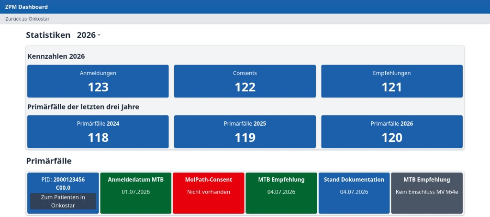

# Onkostar-Plugin "ZPM Dashboard"

Dieses Projekt demonstriert die Bereitstellung einer Single-Page-Application (SPA) eingebettet in ein Onkostar-Plugin.
Realisiert wird hier ein "ZPM Dashboard" für das ZPM Marburg.

## Implementierungshinweise

Dieses Projekt besteht aus zwei Teilen:

* Einer REST-API-Implementierung in einem Onkostar-Plugin.
* Einer Angular-basierten Single-Page-Application (SPA), eingebettet als statische Ressourcen.

### SPA

Wichtig für die Umsetzung ist die Angabe, wo die statischen Ressourcen zur Laufzeit von Onkostar gefunden werden können.

In der Datei `src/main/resources/de/itc/onkostar/library/moduleContext.xml` ist hierfür definiert:

```xml
<mvc:resources mapping="/zpm-dashboard/*.html" location="classpath:/static/" />
<mvc:resources mapping="/zpm-dashboard/*.js" location="classpath:/static/" />
<mvc:resources mapping="/zpm-dashboard/*.css" location="classpath:/static/" />
```

### REST-API

Daten werden durch Spring-Controller im Plugin bereitgestellt.

Beispiel für das Bereitstellen von Statistiken, zum Beispiel unter der URL 
`http://localhost:8080/onkostar/zpm-dashboard/statistics?year=2026`

```java
@RestController
public class ZpmDashboardController {

    @GetMapping("/zpm-dashboard/statistics")
    public ResponseEntity<Statistics> getStatistics(@RequestParam int year) {
        final var statistics = new Statistics( /* ... */ );
        return ResponseEntity.ok(statistics);
    }

}
```

##
} Build

Zunächst muss die SPA gebaut und die resultierenden HTML-, JS- und CSS-Dateien in das Verzeichnis `src/main/static/static`
kopiert werden.
Dies ist erforderlich, damit diese in der resultierenden JAR-Datei enthalten sind.
Hierzu gibt es in einem *Makefile* ein Target, welches zudem alle NPM-Abhängigkeiten installiert:

```bash
make spa
```

Im nächsten Schritt muss mit Gradle das Plugin-JAR gebaut werden.
Auch hierzu gibt es ein Makefile-Target, welches neben dem Bauen der JAR-Datei auch den vorhergehenden Schritt für
das Bauen und Kopieren der SPA einschließt:

```bash
make jar
```

Das Resultat ist ein Onkostar-Plugin mit einer eigenen Oberfläche, die frei gestaltet ist:


